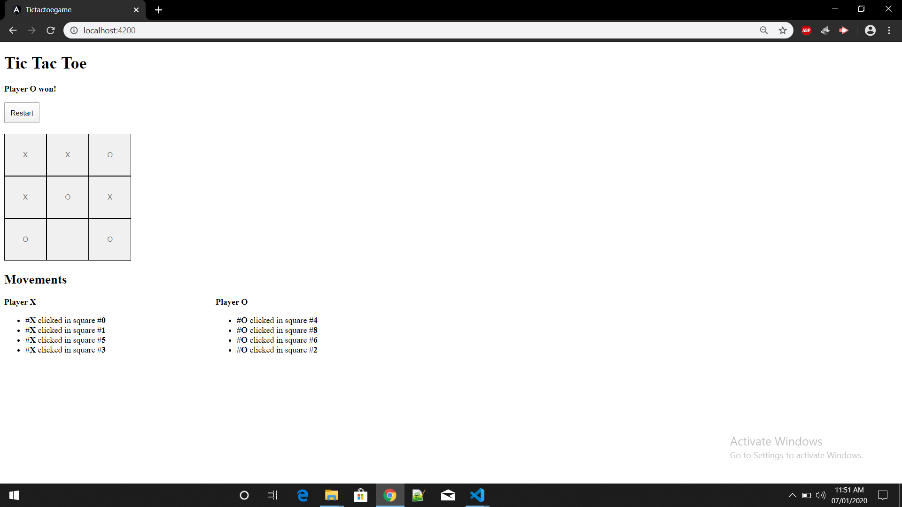

# Tictactoegame

This project was generated with [Angular CLI](https://github.com/angular/angular-cli) version 8.3.20.

## Development server

Run `ng serve` for a dev server. Navigate to `http://localhost:4200/`. The app will automatically reload if you change any of the source files.

# tic-tac-toe
  It is an online game which is played between two players with symbol X and O.
  
  Screenshots of the Project:
  
  1. 
  

  2. 
  
  

